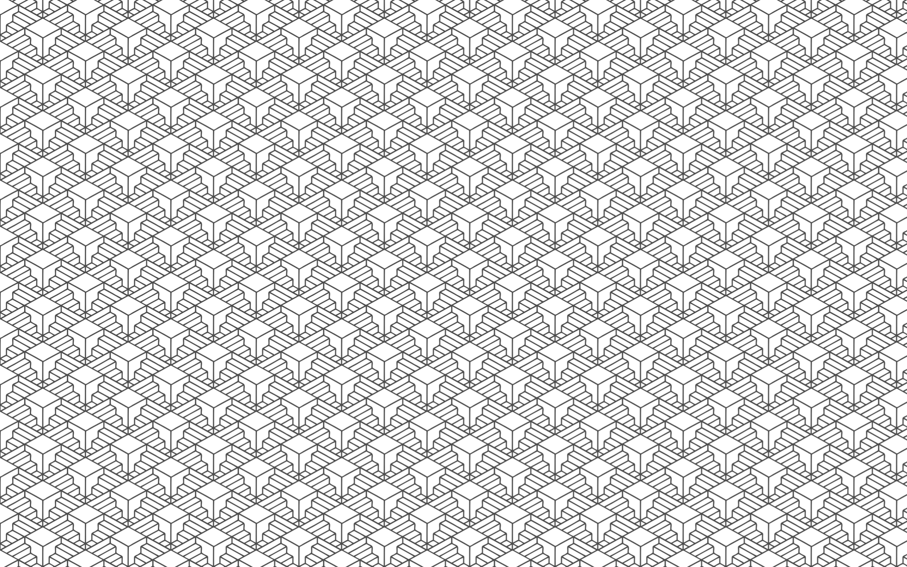
<h1 align="center">
Pattern Recognition
</h1>
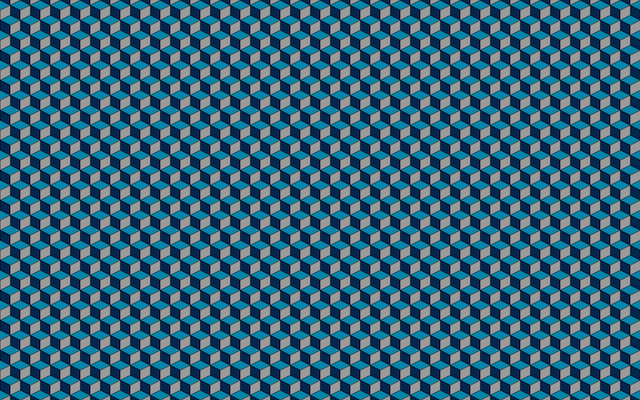

Jump to: 

[Section 1: Intro to Pattern Recognition](#1)

[Section 2: Important Patterns](#2)

[Section 3: AI and Pattern Recognition](#3)

# 1
# What is pattern recognition?

Animals only process a fraction of the vast amounts of sensory information available to them. To handle the large amounts of information, animals focus their attention on important elements of sensory input. In order to know what sensory input is important, animals learn to identify useful patterns in their environments as they encounter similar situations over time. This cognitive process of extracting important information from the environment based on past experience is referred to as *pattern recognition*.

Although all animals beings use pattern recognition as a way to understand their environments, pattern recognition is currently most evolved in humans. [Some](https://www.ncbi.nlm.nih.gov/pmc/articles/PMC4141622/) even argue that this is the main reason why humans are so advanced in comparison to all other species. 

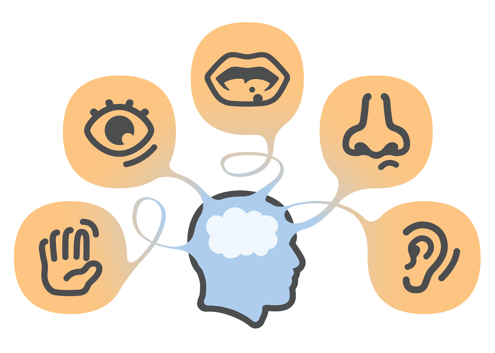

Pattern recognition is an integral part of all human thought because it heavily influences the way humans perceive and interact with the world. To illustrate this, we can explore the role pattern recognition plays on the way humans *see*.

### **Example: Sight**
Scientists know that the [occipital lobe](http://www.spinalcord.com/occipital-lobe) is the region of the brain primarily responsible for processing visual information. 

The occipital lobe contains different types of neurons that fire depending on different types of visual stimuli. For example, the orientation columns of the occipital cortex contain neurons that specialize in detecting the angles of lines. These neurons allow animals to outline the boundaries of shapes, which allows animals to perceive the shapes of objects. 

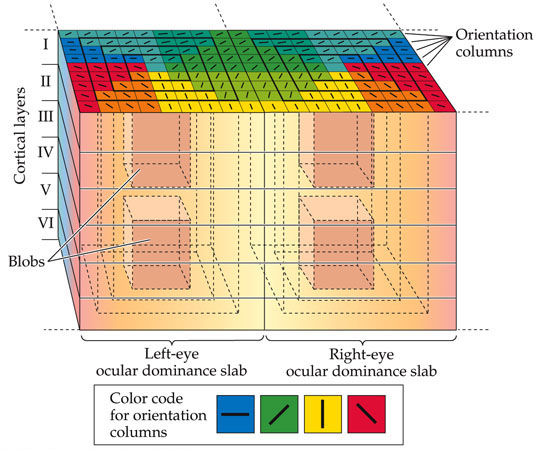

#### This figure illustrates the organization of the orientation columns in the brain.

In 1982, Roger Tootell conducted an experiment which showed that neurons in these specialized regions of occipital lobe will fire in a way that corresponds to the actual perceived shapes. The images below show the way a section of the occipital lobe resembles the visual stimulus. This shows that the visual patterns we see in the real world are the same patterns our neurons create when they fire. The brain learns to recognize these patterns and makes inferences based on these patterns.

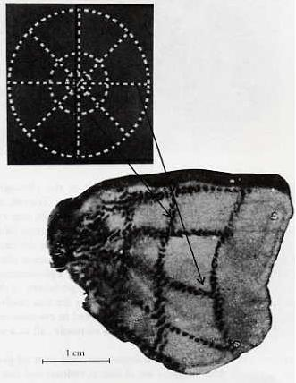

#### Images from [Tootell’s experiment](http://science.sciencemag.org/content/218/4575/902) 

Although scientists do not have a perfectly clear understanding of the way the brain learns to assign meaning to visual objects, they do know that the occipital lobe works in conjunction with the temporal and frontal lobes to do so. The [temporal lobe](http://www.spinalcord.com/temporal-lobe) is important to memory formation, and the [frontal lobe](http://www.spinalcord.com/frontal-lobe) is vital to reasoning and learning. Still, it is clear that learning to recognize visual patterns in our environments is the only way we are able to understand what we see.

### **Optical Illusions: Lines and Angles** 

These optical illusions stimulate the orientation columns in our occipital lobes becuase they involve lines and angles.

Description | Image
------------ | -------------
Angle patterns help determine how we perceive depth.| 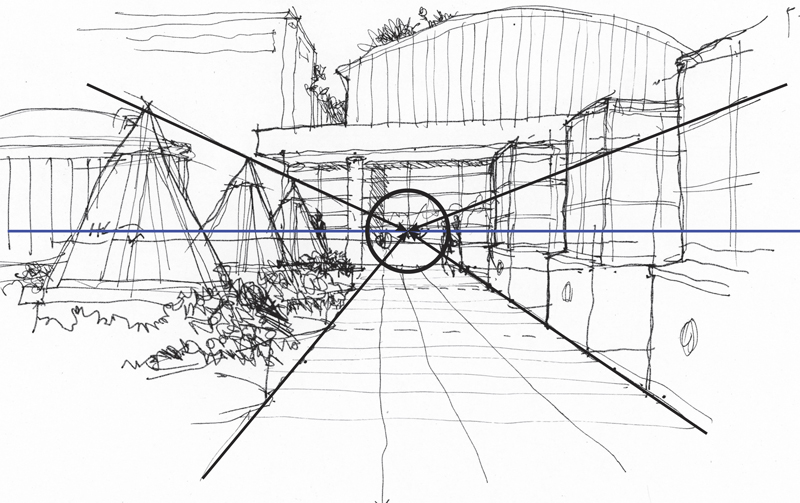
Angle patterns like these usually signal a 3-D object. | 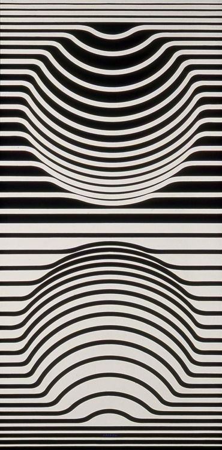
Angles and lines like these usually signal a 3-D triangle that is actually possible. | 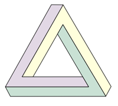


# 2
# What patterns stand out the most to humans? 
Jump to:

[Section 2a: Faces](#2a)

[Section 2b: The Moral Pop-Out Effect](#2b)

# 2a
# Faces

Given that humans are social animals, it is no surprise that we are wired to readily find patterns that suggest the presence of a face. Even newborns seem recognize what patterns indicate faces because they [prefer objects with face-like features over objects with different features](http://journals.sagepub.com/doi/abs/10.1111/1467-9280.00179).

Description | Image
------------ | -------------
Newborn babies preferred the face-like image.| 


Scientists are still [unsure](https://pdfs.semanticscholar.org/83c7/c6cf8db20dc68981a076f8ed554916ce2c8e.pdf) about whether face recognition follows the same path as regular object recognition. However, the existence of Prosopagnosia seems to indicate that there is something unique about face recognition. [Prosopagnosia](https://en.wikipedia.org/wiki/Prosopagnosia) patients only have trouble recognizing familiar faces, not other objects.

### **Optical Illusions: Faces** 

These optical illusions demonstrate how readily we perceive faces in objects.

Object | Image
------------ | -------------
Rock | 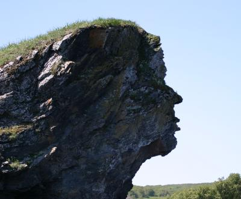
Washer | 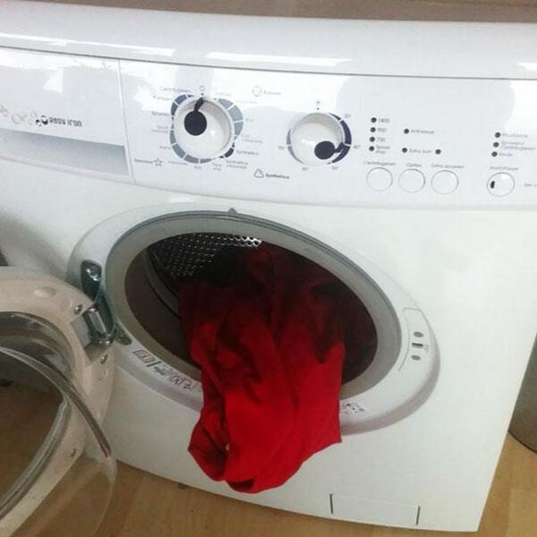
Flying Birds | 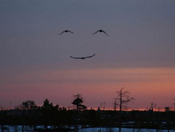

## 2b
## The Moral Pop-Out Effect

Recent [research](https://www.ncbi.nlm.nih.gov/pubmed/24747444) by Gantman and Van Bavel seems to indicate that people perceive religious and moral images more readily than other types of images.

 >"Participants correctly identified moral words more frequently than non-moral words-a phenomenon 
 >we term the moral pop-out effect. The moral pop-out effect was only evident when stimuli were 
 >presented at durations that made them perceptually ambiguous, but not when the stimuli were presented too quickly to perceive or slowly enough to easily perceive. 
  >The moral pop-out effect was not moderated by exposure to harm and cannot be explained by differences in arousal, valence, or extremity."
  
  Here is a graph from their study showing the way moral words were categorized correctly more frequently than non moral words:
  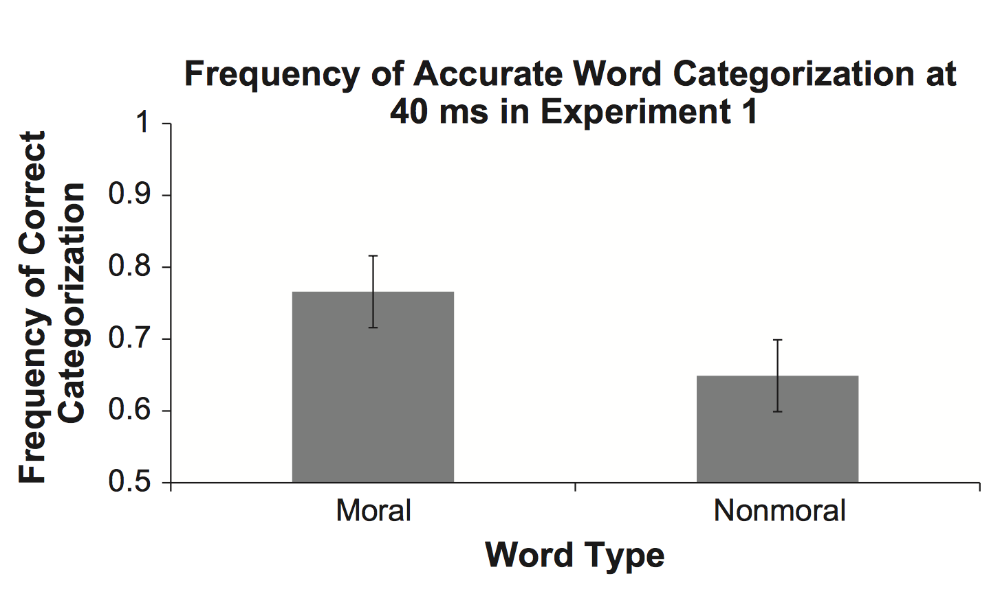

It is important to note, however, that there is still [debate](http://perception.yale.edu/papers/16-Firestone-Scholl-TICS.pdf) about the moral pop-out effect. Scientists still need to conduct more research on the topic.

Still, there is no denying that people frequently see religious and moral images in everyday objects.

### **Optical Illusions: Religious Images** 

Here are a few examples of foods in which people have perceived the image of Jesus.

Food | Image
------------ | -------------
Toast | 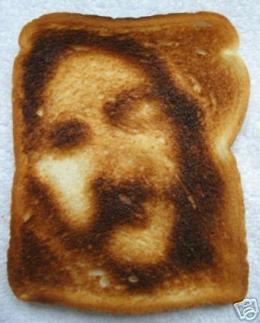
Orange | 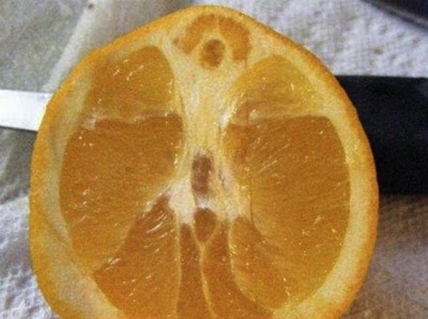
Pizza | 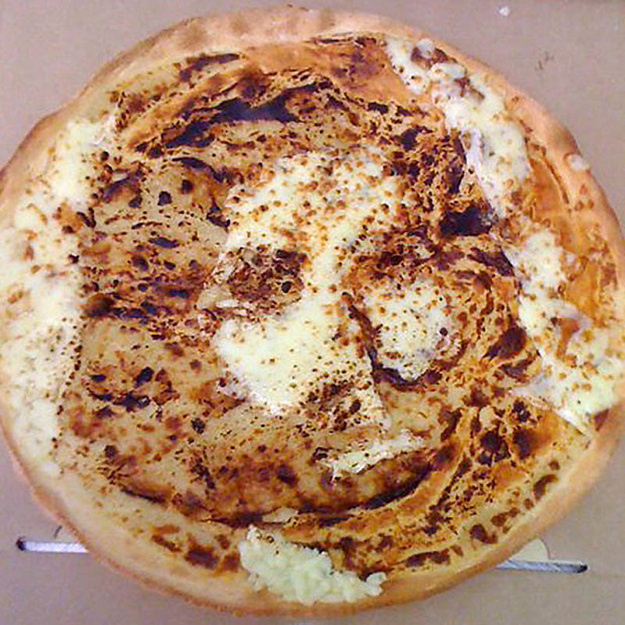

This phenomena is not limited to Christian cultures. In Islamic cultures, there are often reports of appearances of Arabic religious words on objects as well. This is a [wiki page](https://wikiislam.net/wiki/Allah_Written_In_or_On_Various_Things) dedicated to appearances of the word "Allah" on various objects.

This is a [fish](https://www.theguardian.com/uk/2006/feb/02/paullewis) with markings many believed spelled "Allah."

Fish | Image
------------ | -------------
Oscar | 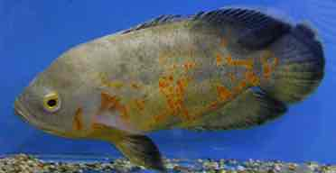

# 3
# What about artificial intelligence?
>“Reverse-engineering the human brain may be regarded as the most important project in the universe.”
> -Ray Kurzweil

Futurist Ray Kurzweil [believes](http://www.newyorker.com/books/page-turner/ray-kurzweils-dubious-new-theory-of-mind) that understanding the way the human brain recognizes patterns may be the key to creating truly powerful artificial intelligence  that will change the course of humanity. 

Currently, however, neuroscientists are still having trouble understanding the brain, and computer scientists are struggling to create machine learning algorithms that recognize patterns as well as humans do. 

Pattern recognition is a huge umbrella term in the field of machine learning. Two subcategories are **clustering** and **linear classification**.

## Clustering


Clustering involves finding patterns in data by finding groups of related data points.
A method to do this is called **k-means clustering.**
The intuition behind is simple. The goal is to minimize mean distance of each point to the center of its cluster.

[Click here](http://shabal.in/visuals/kmeans/2.html) to see an animation of k-means clustering.

The exact implementation will vary depending on the dataset, but this is a generic implementation from [Stanford's CS221 website.](http://stanford.edu/~cpiech/cs221/handouts/kmeans.html)

```markdown
# Function: K Means
# -------------
def kmeans(dataSet, k):
    numFeatures = dataSet.getNumFeatures()
    centroids = getRandomCentroids(numFeatures, k)
    iterations = 0
    oldCentroids = None
    
    while not shouldStop(oldCentroids, centroids, iterations):
        oldCentroids = centroids
        iterations += 1
        labels = getLabels(dataSet, centroids)
        centroids = getCentroids(dataSet, labels, k)
    return centroids

def shouldStop(oldCentroids, centroids, iterations):
    if iterations > MAX_ITERATIONS: return True
    return oldCentroids == centroids

def getLabels(dataSet, centroids):
    # For each element in the dataset, chose the closest centroid. 
    # Make that centroid the element's label.

def getCentroids(dataSet, labels, k):
    # Each centroid is the geometric mean of the points that
    # have that centroid's label. Important: If a centroid is empty (no points have
    # that centroid's label) you should randomly re-initialize it.
```

## Linear Classification

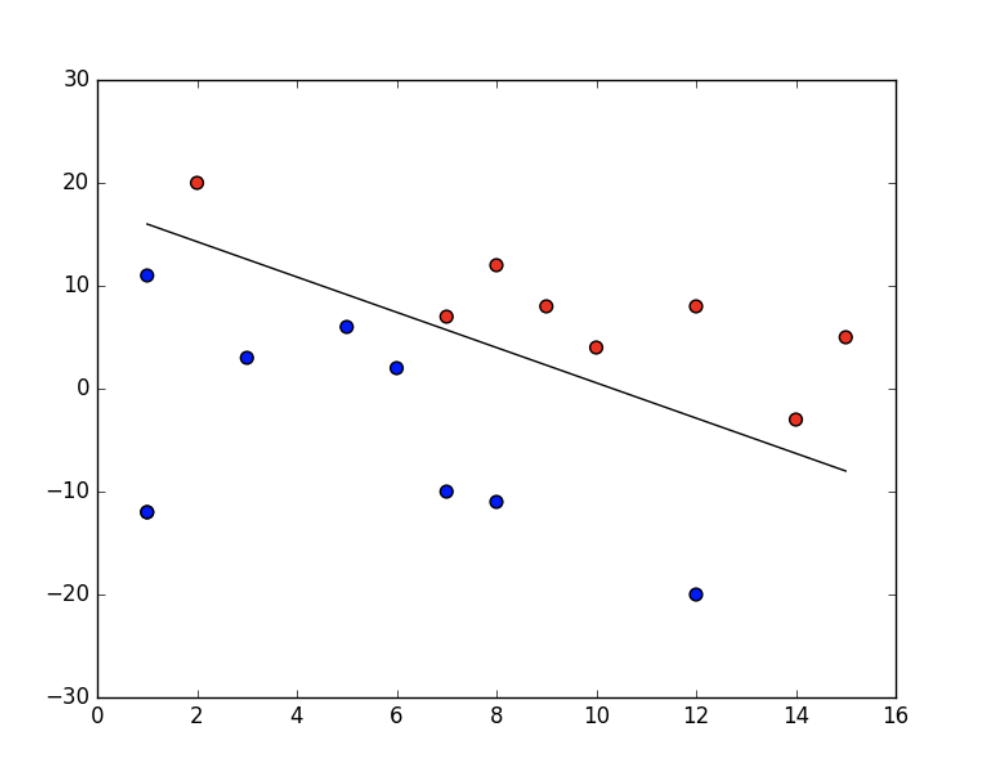

Linear classification aims to find an equation for a line such that it can accurately divide data points into categories. This means that different weights must be tested in the equation to see which of them creates the equation that can classify data best. To minimize the amount of error, it is useful to take the derivative of the error function of the equation and find the global minimum of that derivative. To find the minimum, many use a technique called **gradient descent**.

Once again, the exact implementation may vary. Here is one from a [tutorial](https://www.analyticsvidhya.com/blog/2017/03/introduction-to-gradient-descent-algorithm-along-its-variants/) by Faizan Shaikh.
```markdown
params = [weights_hidden, weights_output, bias_hidden, bias_output]
def gd(cost, params, lr=0.05):
  grads = T.grad(cost=cost, wrt=params)
  updates = []

  for p, g in zip(params, grads):
    updates.append([p, p - g * lr])

  return updates

updates = gd(cost, params)
```
